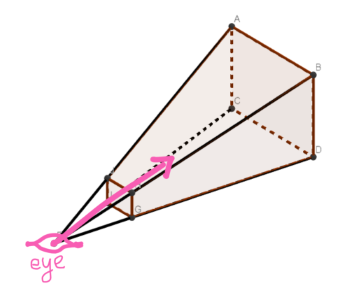
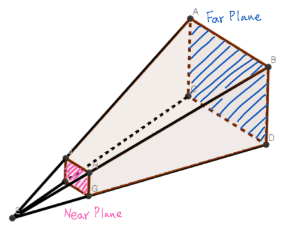
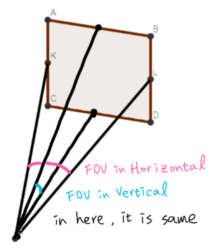

# PerspectiveProjection {#PerspectiveProjection}

Perspective projection will be apply by [AroundView3D],
so we just show the concepts, no details about how to use.  
glm provide a convenience function `perspective`, it create a Perspective Projection
matrix from FOV, distance to near/far plane, aspective ratio.

```c++
    glm::mat4x4 glm::perspective(
        float fov,    // Field Of View
        float aspect, // aspective ratio
        float near,   // distance from virtual camera to near plane
        float far     // distance from virtual camera to near plane
    )
```

Hypothesis your eye/camera is lookAt to a direction, perspective projecttion matrix
will only keep the things inside the region



The part of object that outside the range will be cut off.


there is several important parameters

- `far` is the distance between eye/camera and far plane
- `near` is the distance between eye/camera and near plane



- `FOV` is abbreviation of 'Field of View'. In human's visual system, FOV is different in horizontal and vertical. But in here, there is same.



- `aspect` will be setup by [AroundView3D], so here do not introduce.

[AroundView3D]: @ref AVM::AroundView3d
