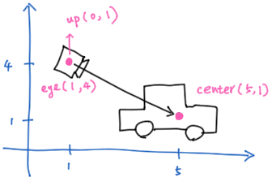
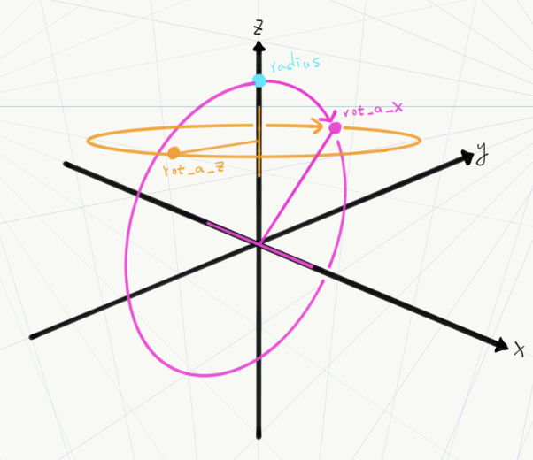

# ViewMatrix {#ViewMatrix}

glm provide a convenience function `lookAt` to calculate view matrix  
the prototype is show below

```c++
    glm::mat4x4 glm::lookAt(
        glm::vec3 eye,
        glm::vec3 center,
        glm::vec3 up
    )
    // in glm, mat4 is alias to mat4x4, so it same
```

the ideal is :

1. your are in position `eye`
2. look at `center`
3. your head top is toward vector `up`, adn it can be always vec3(0,0,1)



## Simplest Sample

_notice:_ vector from `eye` to `center` can not same as `up`, else it will get NaN value, but
you can add a very small value. the simplest sample show below :

```c++
    glm::mat4 viewMatrix = glm::lookAt(
            glm::vec3(0.f, 0.f - 1e-10, 650.f),
            glm::vec3(0.f, 0.f,         0.f),
            glm::vec3(0.f, 0.f,         1.f)
        );
```

## Rotate Around Center



glm provide a convenience function named eulerAngleZX, it create a transform
matrix that rotate point along z-axis and x-axis

```c++
    glm::vec3 center(0.f, 0.f, 200.f); // center of lookAt
    // in eulerAngleZX.fig, center is at (0.f, 0.f, 0.f)
    // but in this snippet, we set in to (0.f, 0.f, 200.f) for a better behavior of operation

    // limit rot_a_x into nearly 0 ~ 90 degrees
    rot_a_x = glm::clamp(rot_a_x, 0.001f, 1.5f); // rotate around x-axis

    // create rotate matrix
    glm::vec4 rotateMatrix = glm::eulerAngleZX(rot_a_z, rot_a_x);

    // use rotate matrix to rotate point radius to a new position
    glm::vec4 radius(0.0f, 0.0f, 350.f, 1.0f);
    glm::vec4 rotated = rotateMatrix * radius;

    // apply the position
    glm::mat4 viewMatrix = glm::lookAt(
        center + rotated.xyz(),
        center,
        glm::vec3(0.0f, 0.0f, 1.0f));
```
